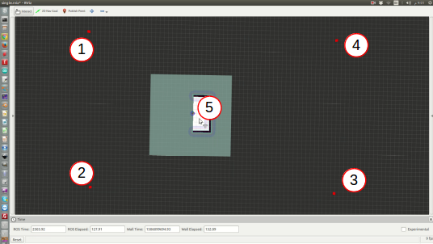

RoboBreizh Simulation Workspace
==============

## Environment 
The code of this workspace works with Ubuntu 16.04 and ROS Kinetic. 
Some parts have been fork from others repositories:

### 3D Gazebo House Environment
[https://github.com/aws-robotics/aws-robomaker-small-house-world](https://github.com/aws-robotics/aws-robomaker-small-house-world)

### Pepper 3D Simulation
Modify URDF and Velocity Plugin

[https://github.com/uchile-robotics-forks/pepper_virtual/tree/feat-magiclab_pepper](https://github.com/uchile-robotics-forks/pepper_virtual/tree/feat-magiclab_pepper)

Control and Pepper Description packages

[https://github.com/awesomebytes/pepper_robot](https://github.com/awesomebytes/pepper_robot)

## Installation
To use this repository we assume that you have a working install of ROS Kinetic.
Follow the steps to install this workspace:
1. Clone the repository 

- `git clone https://github.com/ROBOBREIZH/robobreizh_simu_ws.git`

2. Install the dependencies

- `cd robobreizh_simu_ws`

- `chmod +x ./install.sh && ./install.sh`

3. Build the workspace

- `catkin_make && source devel/setup.bash`

## Launch

### Gazebo Simulation
To launch the main environment for the RoboCup@Home 2021 execute the following command (remember that the workspace should be source):

- `roslaunch simulation robocup_env.launch`

Another test environment can be launch as follow:

- `roslaunch simulation test_env.launch`

### Mapping 
To perform mapping in one of the environment do:

- `roscd navigation`
- `chmod +x ./mapping.sh && ./mapping.sh`

You will be able to choose between 2 different mapping modes: the first one use a frontier-based autonomous exploration to map the environment and the second will launch a teleoperation tool for you to drive the robot around manually (using the keyboard).

#### Frontier-based Exploration: [package rrt_exploration](http://wiki.ros.org/rrt_exploration)

If you choose the option 1 for mapping you need to configure the frontier-based algorithm. First wait that all the windows (Rviz + 2 terminals) are launch and that you have "the map and global costmaps are received" message in the second terminal.
Then, in the Rviz window, you can publish 5 different points (using publish point tool): the 4 first ones will be for the size of the map that you want. The last one is the first goal for the robot and should be in the already mapped area (in white area in Rviz) while the others can be anywhere else.

!!! BE CAREFUL !!! You shouldd respect the following order for the points (left-top, left-bottom, right-bottom, right-top and goal) instead nothing will work:

### Navigation

The navigation is performed through the [ROS Navigation Stack](http://wiki.ros.org/navigation). If you are using the robocup environment you can launch the navigation easily:

- `roslaunch navigation navigation.launch`

This will open Rviz and you can give goal orders to the robot using the 2D nav goal tool.

If you are using another environment you need to provide your map file (.yaml) as an argument:

- `roslaunch navigation navigation.launch map_file:=path_to_my_map/my_map.yaml`

Then when you'll see Rviz window you will need to define the initial position of the robot using the 2D pose estimate tool.

